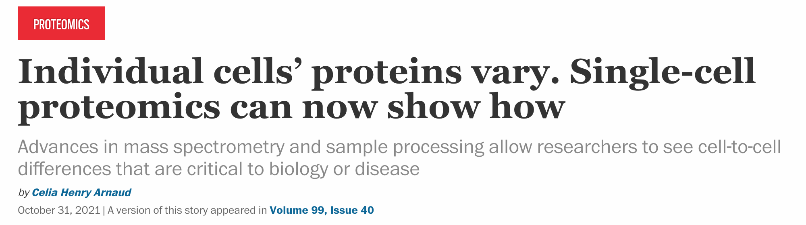



# Single-cell proteomics news

News about advances in single-cell proteomic technologies and their applications to basic biomedical research and to clinical problems.  

&nbsp;

<!--
[{:width="100%" .center-image}](https://www.bioanalysis-zone.com/2020/02/11/single-cell-proteomics-revolution_bo/) -->

&nbsp;

## News and media highlights

&nbsp;

### [The 9th single-cell proteomics conference will be in July 2026](https://single-cell.net)

&nbsp;

[{:width="60%" .center-image}](https://single-cell.net/proteomics/scp2026)

---

&nbsp;

### [The 8th single-cell proteomics conference will be in May 2025](https://single-cell.net)

&nbsp;

[{:width="60%" .center-image}](https://single-cell.net/proteomics/scp2025)

---

&nbsp;

### [Unveiling Proteins: The Future Of Single-Cell Proteomics](https://www.ark-invest.com/podcast/unveiling-proteins-the-future-of-single-cell-proteomics-with-professor-nikolai-slavov?)

&nbsp;

<iframe width="560" height="315" src="https://www.youtube.com/embed/sGW4cFee1IY?si=j3pVmhSM3ed1-Ii7&amp;start=1009" title="YouTube video player" frameborder="0" allow="accelerometer; autoplay; clipboard-write; encrypted-media; gyroscope; picture-in-picture; web-share" referrerpolicy="strict-origin-when-cross-origin" allowfullscreen></iframe>

---

&nbsp;

### [The 7th single-cell proteomics conference will be in May 2024](https://single-cell.net)

&nbsp;

[{:width="60%" .center-image}](https://single-cell.net/proteomics/scp2024)

---

&nbsp;

### [Schmidt Futures Gives $50M for Life Science Research Including Single-Cell Proteomics Institute](https://www.genomeweb.com/proteomics-protein-research/schmidt-futures-gives-50m-life-science-research-including-single-cell)

&nbsp;

[{:width="60%" .center-image}]({{site.baseurl}}/single-cell-proteomics/News_images/Schmidt-Futures-Supports-Single-Cell-Proteomics-Institute.pdf)

[Read more >>](https://www.parallelsq.org/blog/pti-launches-to-scale-protein-analysis-towards-scientific-and-medical-breakthroughs)

---

&nbsp;

### [pSCoPE is published in *Nature Methods*](https://www.nature.com/articles/s41592-023-01830-1)
[{:width="70%" .center-image}](https://scp.slavovlab.net/pSCoPE)

[Research Briefing >>](https://www.nature.com/articles/s41592-023-01786-2)

---

&nbsp;

### [Single-Cell Proteomics Bypasses Bottlenecks, Sways Skeptics](https://www.genengnews.com/topics/omics/proteomics/single-cell-proteomics-bypasses-bottlenecks-sways-skeptics/)
[{:width="40%" .center-image}](https://www.genengnews.com/topics/omics/proteomics/single-cell-proteomics-bypasses-bottlenecks-sways-skeptics/)

---

&nbsp;

### [Advances in LC-MS Workflows for Single Cells](Advances-in-LC-MS-Single-Cells.pdf)
[{:width="70%" .center-image}]({{site.baseurl}}/single-cell-proteomics/Advances-in-LC-MS-Single-Cells.pdf)

[Highlight >>](Advances-in-LC-MS-Single-Cells.pdf)

---

&nbsp;

### [Community Guidelines published in *Nature Methods*](https://www.nature.com/articles/s41592-023-01785-3)
[{:width="70%" .center-image}](https://scp.slavovlab.net)

[Supporting Website >>](https://single-cell.net/guidelines)

---

&nbsp;

### [Untangling the Complexities of Single Cell Protein Analysis](https://www.insideprecisionmedicine.com/topics/molecular-dx-topic/single-cell-technology/untangling-the-complexities-of-single-cell-protein-analysis/)
[{:width="40%" .center-image}](https://www.insideprecisionmedicine.com/topics/molecular-dx-topic/single-cell-technology/untangling-the-complexities-of-single-cell-protein-analysis/)

---

&nbsp;

### [Highlight of single-cell proteomics methods developed by the SCP Center](https://www.nature.com/articles/s41592-022-01611-2)
[{:width="70%" .center-image}](https://www.genengnews.com/topics/omics/uncovering-proteomic-patterns-one-cell-at-a-time/)

---

&nbsp;

### [Highlight of single-cell methodology (plexDIA) developed by the SCP Center](https://www.nature.com/articles/s41592-022-01611-2)
[{:width="70%" .center-image}](https://doi.org/10.1038/s41592-022-01611-2)

---

&nbsp;

### [plexDIA is published in *Nature Biotechnology*](https://www.nature.com/articles/s41587-022-01389-w)
[{:width="70%" .center-image}](https://coe.northeastern.edu/news/nature-biotechnology-published-a-framework-for-multiplicative-scaling-of-single-cell-proteomics-developed-in-the-slavov-laboratory/)

[Research Briefing >>](https://www.nature.com/articles/s41587-022-01411-1)

---

&nbsp;
### [Capital equipment grant from the Massachusetts Life Sciences Center (MLSC)](https://www.masslifesciences.com/baker-polito-administration-announces-5-6-million-in-life-sciences-funding-to-drive-innovation-in-data-science-drug-delivery-and-womens-health/)

{:width="40%" .center-image}

---

&nbsp;
### [The C&EN cover story feature technology pioneered at the SCP Center](https://cen.acs.org/biological-chemistry/proteomics/single-cell-proteomics-mass-spec/99/i40)

[{:width="70%" .center-image}](https://cen.acs.org/biological-chemistry/proteomics/single-cell-proteomics-mass-spec/99/i40)

---

&nbsp;
### [Our protocol for multiplexed single-cell proteomics is published in Nature Protocols](https://www.nature.com/articles/s41596-021-00616-z)
[{:width="70%" .center-image}](https://twitter.com/slavovLab/status/1454419664323366922?s=20)

---

&nbsp;

### [Highlight of single-cell proteomics technology developed by the SCP Center](https://www.nature.com/articles/s41592-021-01243-y)
[{:width="70%" .center-image}](https://www.nature.com/articles/s41592-021-01243-y)

---

&nbsp;

### [Specht named a Rising Stars in Proteomics and Metabolomics](https://pubs.acs.org/doi/full/10.1021/acs.jproteome.0c01026)
[{:width="70%" .center-image}](https://twitter.com/slavov_n/status/1349758653339897859?s=20)

---

&nbsp;

### [Slavov Named Allen Distinguished Investigator for Pioneering Single Cell Proteomics](https://coe.northeastern.edu/news/slavov-named-paul-g-allen-distinguished-investigator-for-pioneering-single-cell-proteomics-research/)
[{:width="70%" .center-image}](https://doi.org/10.1016/j.cbpa.2020.04.018)
The Allen Frontiers Group awarded an [Allen Distinguished Investigator Award](https://alleninstitute.org/what-we-do/frontiers-group/distinguished-investigators/projects/tracking-proteome-dynamics-single-cells) to support the development of a [new technique](https://news.northeastern.edu/2020/10/08/protein-does-a-lot-more-than-build-muscle-why-dont-we-understand-it-better/), dubbed [SCoPE-Dyn](http://slavovlab.net/research.htm#SCoPE-Dyn), that will allow researchers to follow an individual cell’s “protein travelogue”: the changes over time in hundreds of different proteins across thousands of human cells.  

---

&nbsp;

### [Single-cell proteomics review](https://doi.org/10.1016/j.cbpa.2020.04.018) &nbsp;   June 2020
[{:width="70%" .center-image}](https://doi.org/10.1016/j.cbpa.2020.04.018)
Major challenges to single-cell protein analysis by mass-spectrometry and their solutions

---

&nbsp;

### [The single cell proteomics revolution](https://www.bioanalysis-zone.com/2020/02/11/single-cell-proteomics-revolution_bo/) &nbsp;   Feb 2020
[{:width="80%" .center-image}](https://www.bioanalysis-zone.com/2020/02/11/single-cell-proteomics-revolution_bo/)

---

&nbsp;

### [Single-cell proteomics perspective in Science](https://science.sciencemag.org/content/367/6477/512) &nbsp;   Jan 2020
[{:width="70%" .center-image}](https://doi.org/10.1126/science.aaz6695)
Single-cell mass spectrometry will help reveal mechanisms that underpin health and disease

---

&nbsp;

### [Single-cell proteomics technology feature in Nature Methods](https://www.nature.com/articles/s41592-019-0540-6) &nbsp;   Aug 2019
[{:width="80%" .center-image}](https://www.bioanalysis-zone.com/2020/02/11/single-cell-proteomics-revolution_bo/)

---

&nbsp;

### [Improving single-cell proteomics technology](https://coe.northeastern.edu/news/improving-protein-measuring-technology/) &nbsp;   Jul 2019

---

&nbsp;

### [Risky idea could mean big things for regenerative medicine](http://news.northeastern.edu/2018/10/22/how-this-researchers-risky-idea-could-mean-big-things-for-regenerative-medicine/) &nbsp;   Oct 2018

---

&nbsp;

### [Northeastern University hosts the first Single-Cell Proteomics Conference](https://coe.northeastern.edu/news/northeastern-engineering-hosts-first-single-cell-proteomics-conference/) &nbsp;   June 2018
[{:width="80%" .center-image}](http://single-cell.net/proteomics/networks)

---

&nbsp;

### The 4th [single-cell proteomics conference](https://single-cell.net/proteomics/scp2021) is in August 2021.

<h2 style="letter-spacing: 2px; font-size: 28px; text-align: center;" id="single-cell-proteomics-conference-2020">
<a href="https://single-cell.net/proteomics/scp2021">Fourth single-cell proteomics conference (SCP2021)</a>
</h2>

&nbsp;

<iframe width="560" height="315" src="https://www.youtube.com/embed/NNLh4nE687I" frameborder="0" allow="accelerometer; autoplay; encrypted-media; gyroscope; picture-in-picture" allowfullscreen></iframe>

------------
